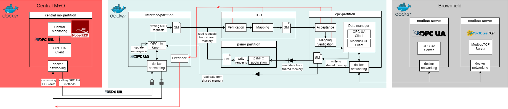
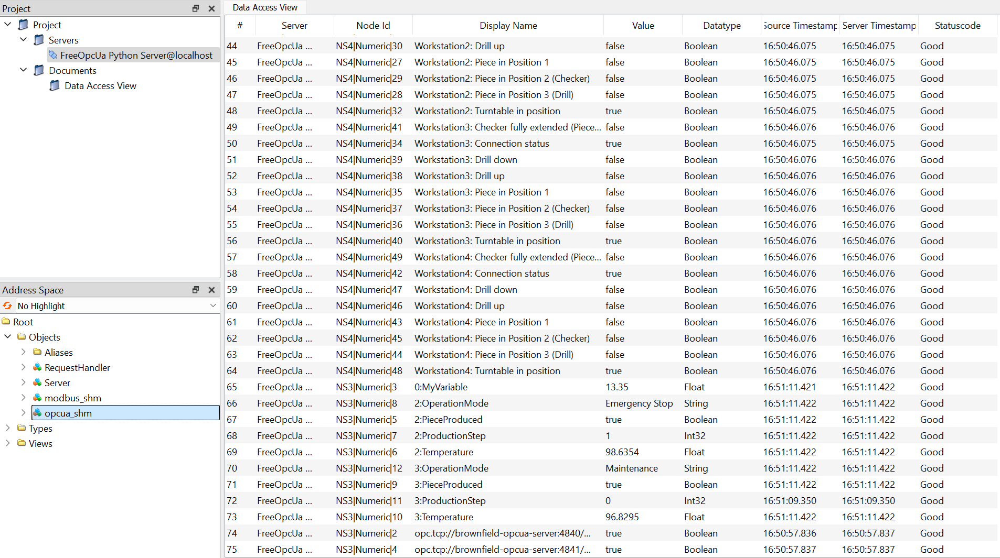
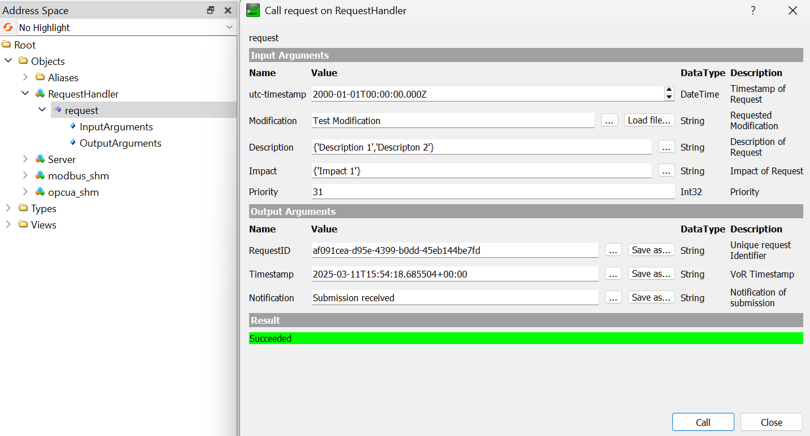

**siot-gateway-docker**
=======================

A Docker-based IoT gateway setup for OPC UA and ModbusTCP communication.

This repository contains a Docker Compose setup for follwing containers:

## Brownfield
-  **brownfield-server**: A simple OPC UA server container. Used for emulating a brownfield environment. This example is based on the example server-with-encryption.py provided by the FreeOpcUa Python library [(Link)](https://github.com/FreeOpcUa/opcua-asyncio/blob/master/examples/server-with-encryption.py).
- **modbus-server**: A Modbus TCP Server written in Python used for testing the collection from different registers. It is based on the Docker image [oitc/modbus-server](https://github.com/cybcon/modbus-server).

## Gateway
- **cpc-partition**: A container with a ModbusTCP and an OPC UA client. These clients consume data from their corresponding servers inside the network and store this information in a shared memory using XML-Format.
(0) distribute opcua and modbustcp clients in classes to create them according to the endpoints.xml
- **psmo-partition**: Contains a Python script for reading the shared memory of the cpc-partition and consuming the machine data stored inside.
- **interface-partition**: OPC UA Server accessible from IT-side. Updates variables in namespace using the xml-file stored in shared memory from the cpc-partition container.

## Central M+O Applications
- **WIP: central-mo-client**: OPC UA Client and business function. Uses the data exposed by the OPC UA Server for a currently undefined business function, e.g. visualization via node-red.


## Prerequisites
* Docker installed on your system.

**Usage**
---------

### Clone the repository

Clone the repository using Git:
```bash
git clone https://gitlab.technik-emden.de/bmbf_siot-gateway/secure-iot-gateway.git
```

### Build and run the containers using docker-compose
Navigate to the repository directory
```bash
cd siot-gateway-docker
```
Building, (re)creating, starting, and attaching to containers for a service:
```bash
docker-compose up
```

Or run the following command to build and run the containers in detached mode:
```bash
docker-compose up -d
```
In detached mode you can access the containers using the following commands:
```bash
docker exec -it {container-name} /bin/bash
```
### UAExpert view of the aggregated endpoints from CPC


### UAExpert VoR method call


### Docker Terminal


```bash
Attaching to brownfield-opcua-server, central-mo-client, interface-partition, intermediate-vor-partition
brownfield-opcua-server     | Brownfield OPC UA Servers started successfully.
interface-partition         | OPC UA Server of the interface partition is running.
central-mo-client           | Central M+O Application started.

# Submit Requests with running interface-partition, but offline intermediate-vor-partition: => requests will be stored in POSIX queue
central-mo-client           | Submit request with priority 9 at 2025-03-11 15:43:09.646760+00:00
interface-partition         | Request with priority 9 at 2025-03-11T15:43:09.651060+00:00 received and forwared.
central-mo-client           | Request ID:       cada693b-8e9a-4a77-8f96-21fbb38f91a6                                                                                  
central-mo-client           | Server Timestamp: 2025-03-11T15:43:09.651060+00:00                                                                                      
central-mo-client           | Notification:     Submission received
central-mo-client           | Submit request with priority 24 at 2025-03-11 15:43:11.655272+00:00                                                                     
interface-partition         | Request with priority 24 at 2025-03-11T15:43:11.657791+00:00 received and forwared.
central-mo-client           | Request ID:       32a0938f-f626-4873-b959-df3137f21517                                                                                  
central-mo-client           | Server Timestamp: 2025-03-11T15:43:11.657791+00:00
central-mo-client           | Notification:     Submission received                                                                                                   
central-mo-client           | Submit request with priority 5 at 2025-03-11 15:43:13.661215+00:00
interface-partition         | Request with priority 5 at 2025-03-11T15:43:13.662997+00:00 received and forwared.
central-mo-client           | Request ID:       a5592e3d-2448-43b0-afb1-133ac1b74a5c                                                                                  
central-mo-client           | Server Timestamp: 2025-03-11T15:43:13.662997+00:00
central-mo-client           | Notification:     Submission received                                                               

# intermediate-vor-partition started and begins processing message queue content with respect to the priority of the request.
intermediate-vor-partition  | Intermediate VoR Partition started!
intermediate-vor-partition  | Message Queue /interface_partition_mq attached!
intermediate-vor-partition  | Request with priority 24 and payload b"{'request_id': '32a0938f-f626-4873-b959-df3137f21517', 'timestamp': datetime.datetime(2025, 3, 11, 15, 43, 11, 655272, tzinfo=datetime.timezone.utc), 'modification': 'Enhance automated assembly line', 'description': {'description_0': 'Refactor sensor data integration', 'description_1': 'Install new automation features', 'description_2': 'Enable production line optimization'}, 'impact': {'impact_0': 'Lower operational costs', 'impact_1': 'Higher yield rates'}, 'prio': 24}" received.
intermediate-vor-partition  | Request with priority 9 and payload b"{'request_id': 'cada693b-8e9a-4a77-8f96-21fbb38f91a6', 'timestamp': datetime.datetime(2025, 3, 11, 15, 43, 9, 646760, tzinfo=datetime.timezone.utc), 'modification': 'Improve sensor calibration process', 'description': {'description_0': 'Enhance production scheduling'}, 'impact': {'impact_0': 'Increased throughput', 'impact_1': 'Faster production cycles', 'impact_2': 'Improved resource utilization'}, 'prio': 9}" received.
intermediate-vor-partition  | Request with priority 5 and payload b"{'request_id': 'a5592e3d-2448-43b0-afb1-133ac1b74a5c', 'timestamp': datetime.datetime(2025, 3, 11, 15, 43, 13, 661215, tzinfo=datetime.timezone.utc), 'modification': 'Update production software', 'description': {'description_0': 'Update system diagnostics'}, 'impact': {'impact_0': 'Higher yield rates'}, 'prio': 5}" received.

# Now the request come in and all partitions that are associated with their processing are running.
central-mo-client           | Submit request with priority 14 at 2025-03-11 15:43:15.665898+00:00
interface-partition         | Request with priority 14 at 2025-03-11T15:43:15.667656+00:00 received and forwared.
intermediate-vor-partition  | Request with priority 14 and payload b"{'request_id': '69460836-f61e-448d-8f7a-c8edf25135d6', 'timestamp': datetime.datetime(2025, 3, 11, 15, 43, 15, 665898, tzinfo=datetime.timezone.utc), 'modification': 'Install new production machinery', 'description': {'description_0': 'Enhance production scheduling'}, 'impact': {'impact_0': 'Enhanced system reliability', 'impact_1': 'Faster production cycles'}, 'prio': 14}" received.
central-mo-client           | Request ID:       69460836-f61e-448d-8f7a-c8edf25135d6
central-mo-client           | Server Timestamp: 2025-03-11T15:43:15.667656+00:00
central-mo-client           | Notification:     Submission received                                                                 

central-mo-client           | Submit request with priority 28 at 2025-03-11 15:43:17.670960+00:00                                                                 
interface-partition         | Request with priority 28 at 2025-03-11T15:43:17.673943+00:00 received and forwared.
intermediate-vor-partition  | Request with priority 28 and payload b"{'request_id': '650b6353-0706-4513-ba86-2e3dafcf86e0', 'timestamp': datetime.datetime(2025, 3, 11, 15, 43, 17, 670960, tzinfo=datetime.timezone.utc), 'modification': 'Implement new machine learning model', 'description': {'description_0': 'Enable production line optimization', 'description_1': 'Install new automation features'}, 'impact': {'impact_0': 'Reduced downtime'}, 'prio': 28}" received.
central-mo-client           | Request ID:       650b6353-0706-4513-ba86-2e3dafcf86e0
central-mo-client           | Server Timestamp: 2025-03-11T15:43:17.673943+00:00                                                                                      
central-mo-client           | Notification:     Submission received

central-mo-client           | Submit request with priority 2 at 2025-03-11 15:43:19.677723+00:00
intermediate-vor-partition  | Request with priority 2 and payload b"{'request_id': '14ec21c6-00d8-4dcc-9a97-8674ca8caf4d', 'timestamp': datetime.datetime(2025, 3, 11, 15, 43, 19, 677723, tzinfo=datetime.timezone.utc), 'modification': 'Upgrade system monitoring tools', 'description': {'description_0': 'Update system diagnostics', 'description_1': 'Update inventory tracking system', 'description_2': 'Install new automation features'}, 'impact': {'impact_0': 'Reduced downtime'}, 'prio': 2}" received.
interface-partition         | Request with priority 2 at 2025-03-11T15:43:19.680922+00:00 received and forwared.
central-mo-client           | Request ID:       14ec21c6-00d8-4dcc-9a97-8674ca8caf4d
central-mo-client           | Server Timestamp: 2025-03-11T15:43:19.680922+00:00                                                                                      
central-mo-client           | Notification:     Submission received
```

**Dependencies**
--------------

* Python 3.x libraries:
	+ `asyncua` for OPC UA communication
	+ `pymodbusTCP` for ModbusTCP communication
	+ `posix-ipc` for POSIX-based inter-partition communication

**Troubleshooting**
------------------

* If you encounter issues with the containers, please contact heiko.schoon@hs-emden-leer.de.


**Licensing**
------------------
Gratis or libre? ... No, gratis and libre:
This is free software (free as in speech and free as in beer) released under a MIT license. Complete licensing information is available in the [LICENSE](./LICENSE) file.
